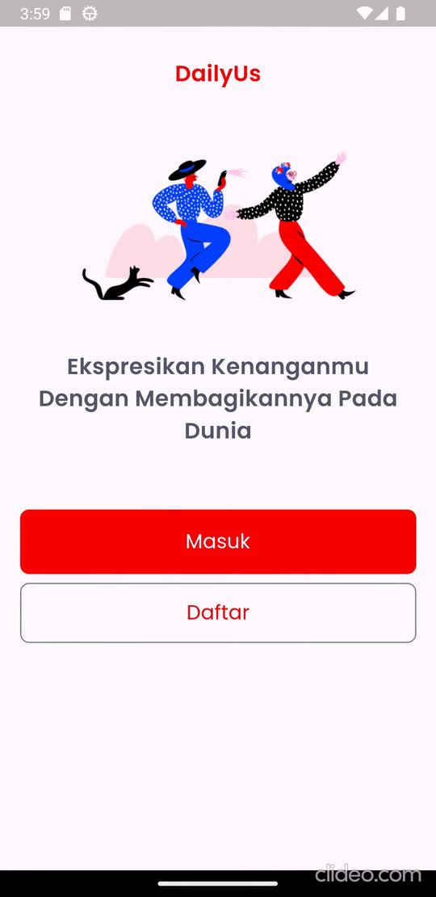
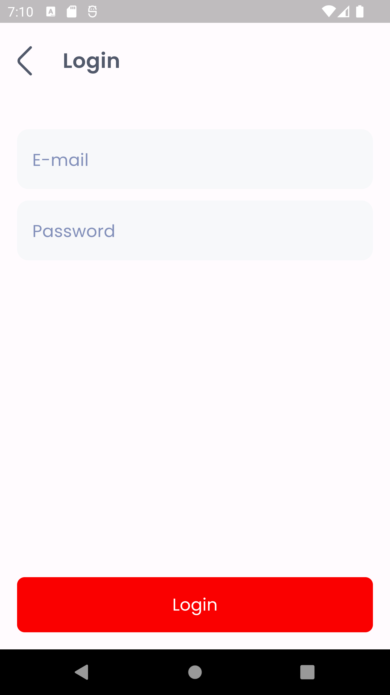
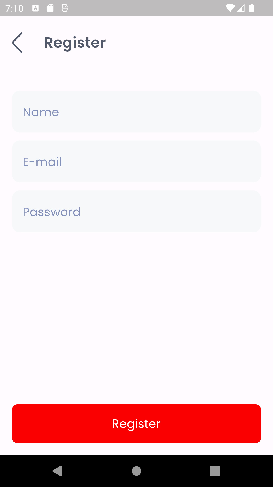
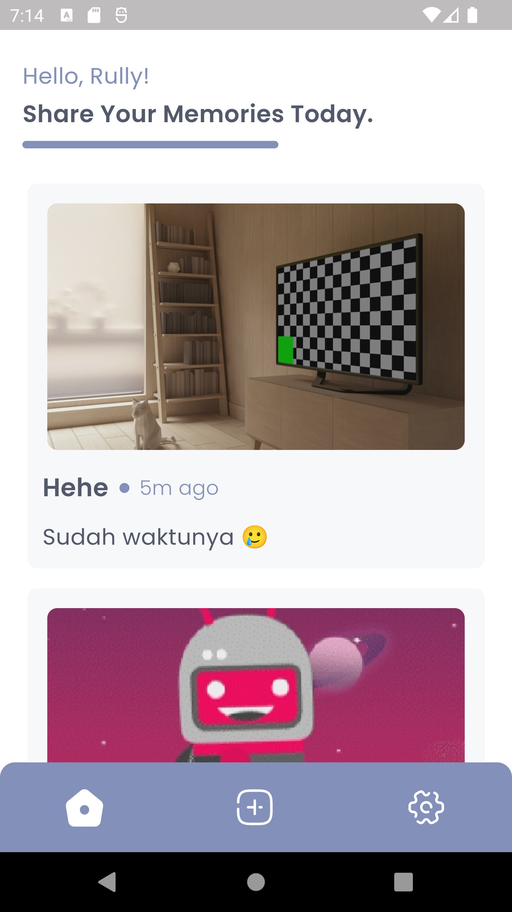
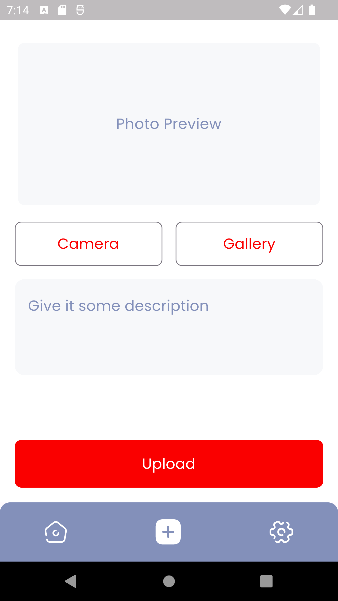
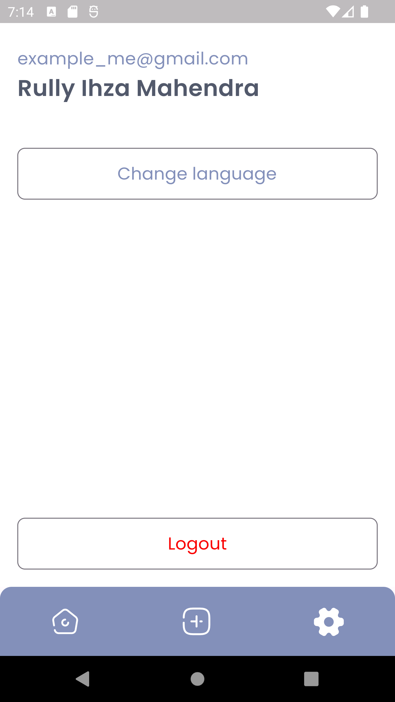
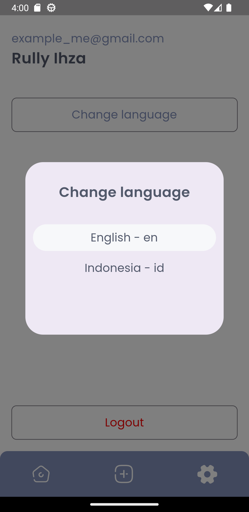
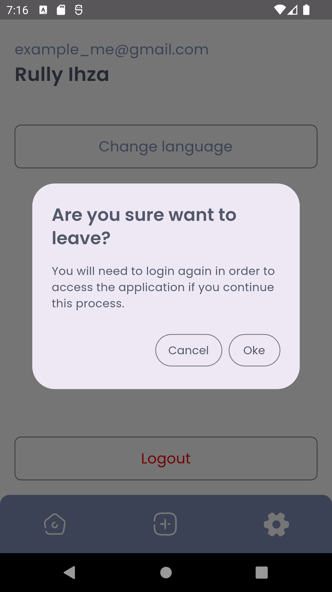

# DailyUs Flutter

This project was part of submission projects to finish the Dicoding Indonesia's Flutter Intermediate course. The main purpose of this submission was to challenge students to create a posting-stories-like app. The app being built had to be using Localization.

# Preview

    

# Tech Stack

- Dart/Flutter
- Dependency Injection
- Navigator 2.0 (Router Delegation, Route Information Parser, and Page Configuration)
- Authentication feature (register, login and logout)
- Localization for accessibility (supports only *en* and *id*)
- Flutter Bloc
- Shimmer Effect